<p align="center">
  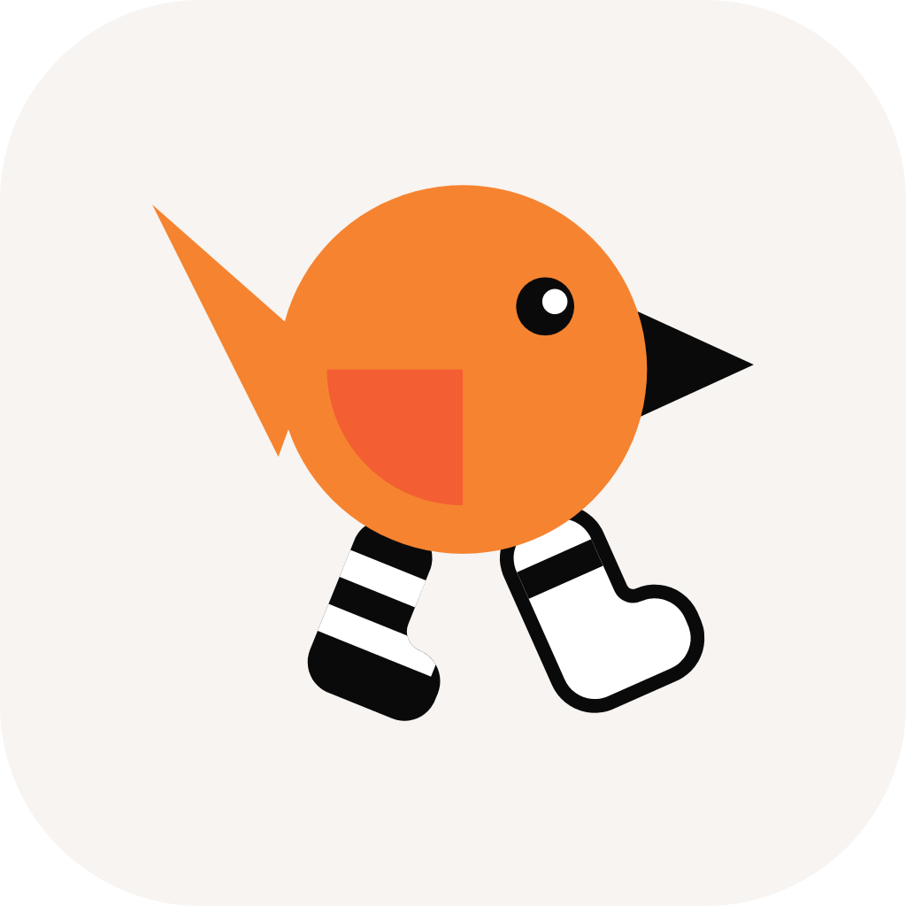
</p>

<h1 align="center">BirdSocks</h1>

<p align="center">
  <strong>Unofficial NetBird client for Android — your mesh as a SOCKS5 proxy, a DNS proxy or a VPN</strong>
</p>

<p align="center">
  <strong>English</strong> | <a href="readme_ru.md">Русский</a>
</p>

<table align="center">
  <tr>
    <th>Release</th>
    <th>Downloads</th>
    <th>NetBird core</th>
    <th>Android</th>
    <th>License</th>
  </tr>
  <tr>
    <td align="center"><a href="https://github.com/bropines/birdsocks/releases/latest"></a></td>
    <td align="center"><a href="https://github.com/bropines/birdsocks/releases"></a></td>
    <td align="center"><a href="https://github.com/netbirdio/netbird/releases/tag/v0.80.0"></a></td>
    <td align="center"></td>
    <td align="center"><a href="LICENSE"></a></td>
  </tr>
</table>

<table align="center">
  <tr>
    <td align="center"><a href="https://github.com/bropines/birdsocks/releases/latest"></a></td>
    <td align="center"><a href="https://apps.obtainium.imranr.dev/redirect?r=obtainium://add/https://github.com/bropines/birdsocks"></a></td>
  </tr>
  <tr>
    <td align="center"><a href="https://github.com/bropines/birdsocks/releases"></a></td>
    <td align="center"><a href="https://boosty.to/pinus"></a></td>
  </tr>
</table>

<p align="center">
  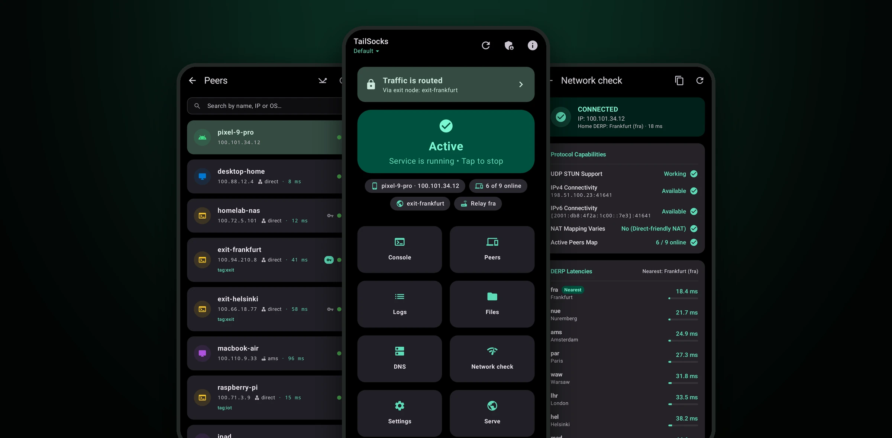
</p>

---

BirdSocks runs the real [NetBird](https://netbird.io) client on your phone as a userspace node and hands its network to apps the way you choose:
- a **local SOCKS5 proxy** that needs no VPN permission and lives next to any other VPN, ad-blocker or proxy client;
- a **DNS proxy** that answers NetBird names;
- a **VPN mode** for apps that cannot use a proxy.

Everything NetBird offers is there: peers and networks, exit nodes, NetBird DNS, several accounts, self-hosted servers. On networks that block the NetBird server, a built-in **ByeDPI** or your own proxy carries the connection to it.

It says what is actually going on:
- whether you are connected, and how each peer is reached (directly, through a relay, or idle until needed);
- whether the exit node really forwards anything;
- what the server's DNS gave this device;
- which firewall rule drops a packet.

> What each release contains is in [`CHANGELOG.md`](CHANGELOG.md).

---

## ✨ Features

<p align="center">
  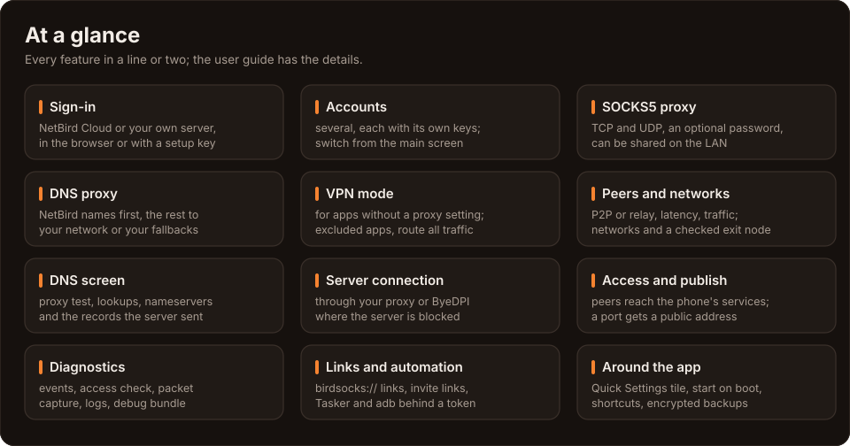
</p>

### Networking

| Feature | Description |
|---|---|
| **SOCKS5 proxy** | `127.0.0.1:48125` by default, or any 127.x address. It carries TCP and UDP and can ask for a username and password, which you need before you open it to the LAN. Peers and the networks they route go through NetBird; everything else goes out directly or through the exit node. |
| **DNS proxy** | `127.0.0.1:48153`. It answers NetBird names first and asks the network's resolvers, or your own fallbacks, for the rest, all at once. A NetBird name never goes to a public resolver. |
| **VPN mode (TUN)** | For apps with no proxy setting, through hev-socks5-tunnel into the same proxy. Only NetBird's ranges go in by default; all traffic goes in with an exit node, a domain route or one switch. Apps can be excluded. |
| **Exit nodes and networks** | Choose networks and an exit node. The exit node is checked through the proxy, and one that forwards nothing is flagged with a way out. |
| **Server connection** | Reach management, signal and the relay through a SOCKS5 or HTTP proxy, or through the built-in **ByeDPI**, where the server is blocked or its TLS handshake is filtered. |
| **Access to the phone** | Peers reach the phone's own services (adb, Termux's `sshd`, a web server) on its NetBird address, as your ACLs allow. BirdSocks' own proxies stay closed to peers. |
| **Publish** | A local port gets a public HTTPS address through NetBird's reverse proxy, protected by a PIN, a password or SSO groups. |

### Accounts and management

| Feature | Description |
|---|---|
| **Sign-in** | NetBird Cloud or your own server, through the browser (SSO) or with a setup key. |
| **Several accounts** | Each account has its own keys and settings, and you switch from the main screen. A new account takes its server and key at once, and an **invite link** fills it in. |
| **Peers** | This device first, then every peer: its path (P2P or relay), latency, traffic and the networks it routes. Peers that are idle under lazy connections are shown as idle. |
| **DNS screen** | The proxy test, lookups, nameservers, and **every DNS record the server gave this device**, with a filter. |
| **Session** | Expiry is shown ahead of time, and the session is extended in the browser without reconnecting. |

### Diagnostics

| Feature | Description |
|---|---|
| **Connection** | Management, signal and each relay with its transport and error; NetBird's DNS servers; this device's addresses. |
| **Events** | NetBird's network, DNS, sign-in and connection events; warnings arrive as notifications. |
| **Access check** | What NetBird's firewall does with a packet to or from a peer, and which rule decides. |
| **Logs and capture** | Filtered logs, packet capture to `.pcap`, and the debug bundle (anonymized, saved or uploaded to NetBird). |

### Around the app

| Feature | Description |
|---|---|
| **Automation** | Tasker and adb intents behind a token (connect, disconnect, exit node, account, VPN mode, server connection), and a status reply. |
| **Links** | `birdsocks://` opens any screen. Action links ask before they act, and invite links open a filled-in new account. |
| **Backups** | A settings file, or a full backup with NetBird's accounts and keys under a password. |
| **40 app icons** | Pick one in Settings → Appearance & language, in BirdSocks' colours or NetBird's. |
| **The rest** | A Quick Settings tile, start on boot, launcher shortcuts, Material 3 with dynamic colour, two panes on tablets, English and Russian. |

---

## 📸 Screenshots

<table>
  <tr>
    <td width="25%" align="center">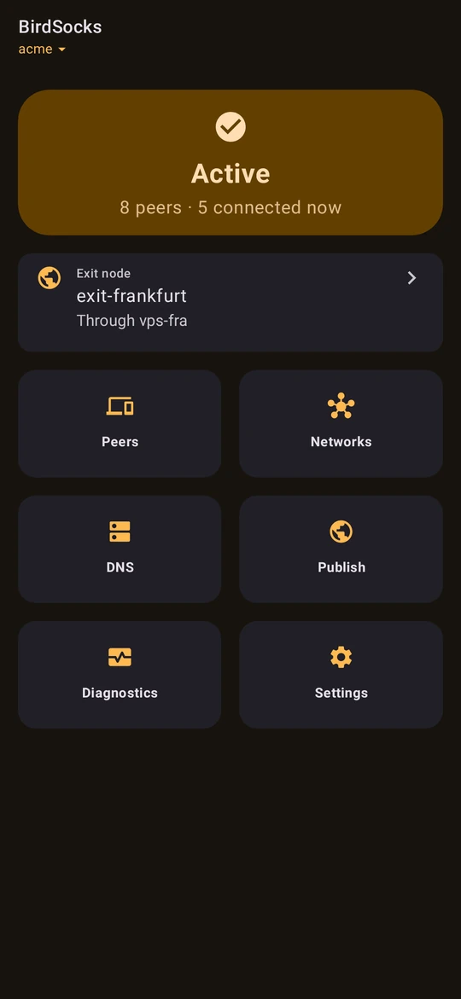<br/><sub>Connected, with the exit node and six tiles</sub></td>
    <td width="25%" align="center">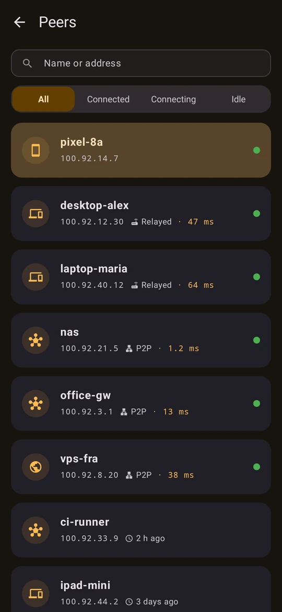<br/><sub>Peers: P2P, relayed or idle</sub></td>
    <td width="25%" align="center">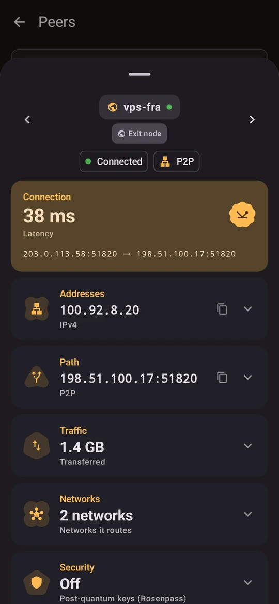<br/><sub>A peer: latency, path, traffic, networks</sub></td>
    <td width="25%" align="center">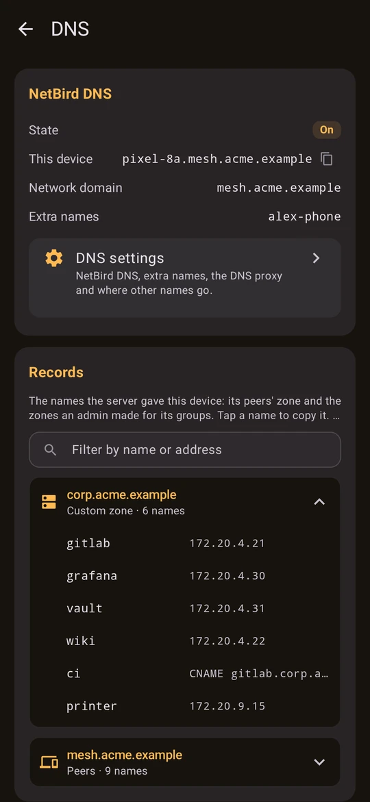<br/><sub>The DNS records the server gave this device</sub></td>
  </tr>
  <tr>
    <td width="25%" align="center">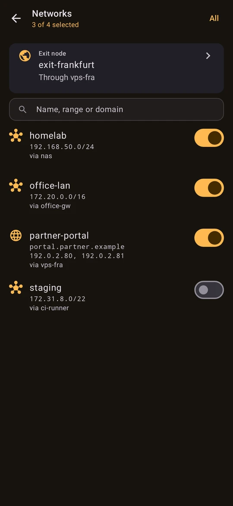<br/><sub>Networks and the exit node</sub></td>
    <td width="25%" align="center">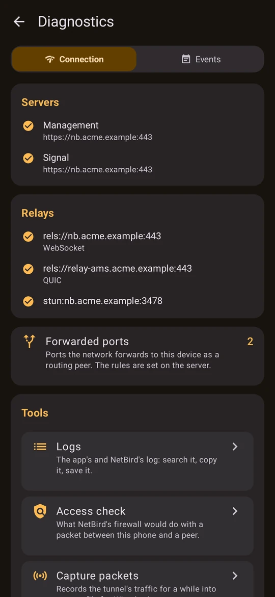<br/><sub>Servers, relays and their transports</sub></td>
    <td width="25%" align="center">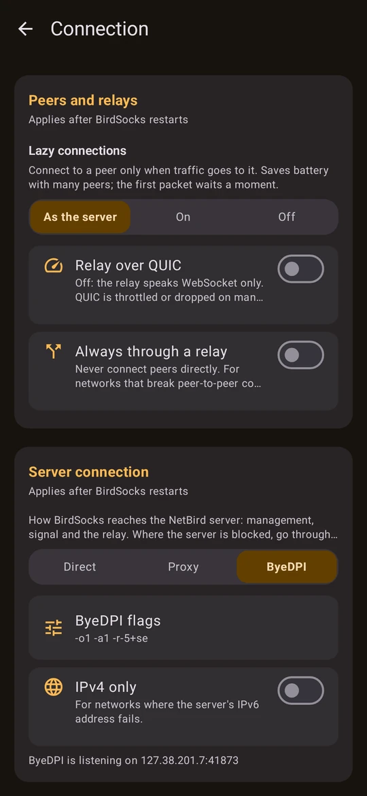<br/><sub>The server through a proxy or ByeDPI</sub></td>
    <td width="25%" align="center">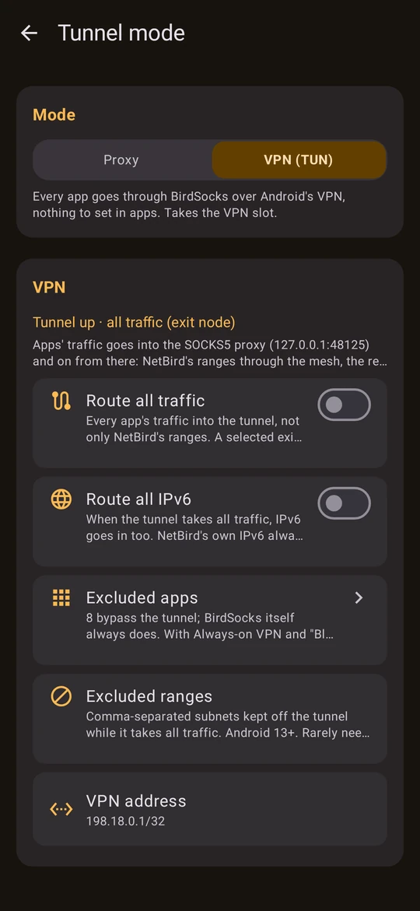<br/><sub>VPN mode for apps without a proxy</sub></td>
  </tr>
  <tr>
    <td colspan="2" align="center">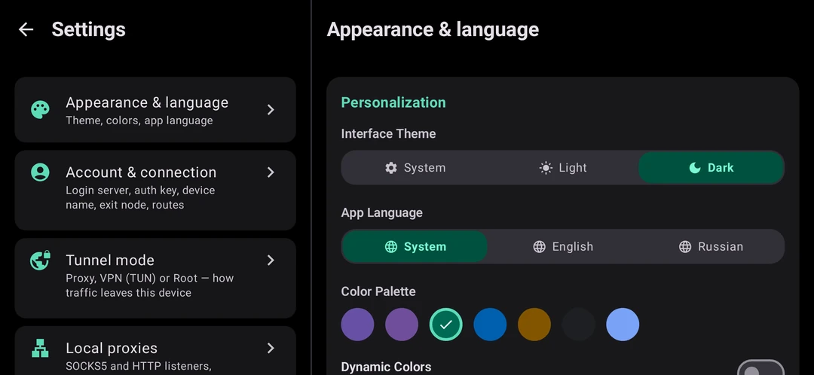<br/><sub>Settings side by side in landscape</sub></td>
    <td colspan="2" align="center"><br/><sub>Tablets and foldables get two panes</sub></td>
  </tr>
</table>

<sub>Rendered from an invented network by the app's own preview tests, with no device and nobody's real data: see <a href="scripts/readme_shots.py"><code>scripts/readme_shots.py</code></a>.</sub>

---

## 🏗️ How it works

<p align="center">
  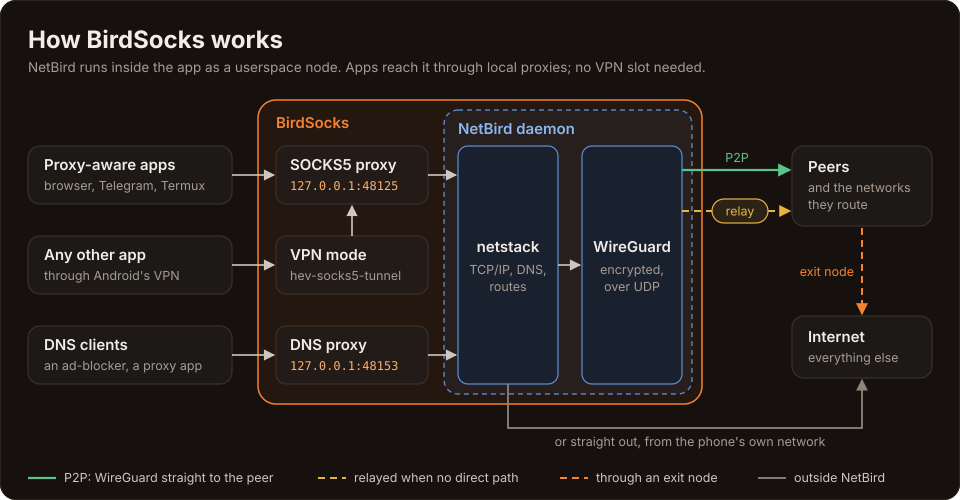
</p>

<p align="center">
  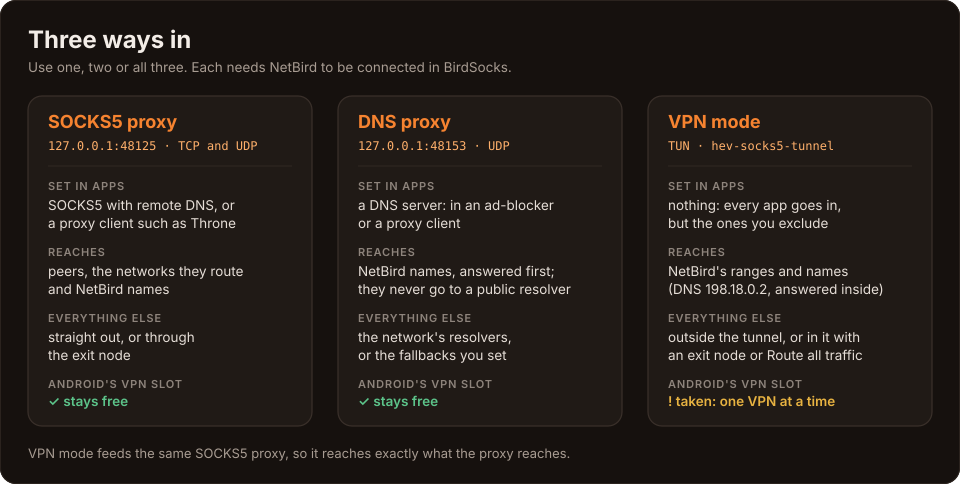
</p>

### Layers

| Layer | Technology | Purpose |
|---|---|---|
| **Daemon** | Go → `libnetbird.so` | NetBird's own daemon (`client/server`) from a pinned release, plus 8 patches. It is built as a static `GOOS=linux` binary and runs in netstack mode as a child process of the app. |
| **Bridge** | Go → `appctr.aar` (gomobile) | Starts and stops the daemon, gives it the Android facts a Linux binary cannot find (DNS servers, time zone, device), and relays its gRPC API to Kotlin. |
| **App** | Kotlin + Jetpack Compose | The foreground service, the screens, VPN mode, ByeDPI, backups and automation. |
| **Native** | C → `hev-socks5-tunnel`, `byedpi` | The tunnel engine of VPN mode, and the DPI bypass for the server connection. |

### Design rules

- **The daemon is NetBird's.** The app talks to it only through its gRPC API, never through a CLI. Behaviour changes only through a small, documented patch.
- **The proxies outlive the engine.** The SOCKS5 and DNS proxies stay up through reconnects, account switches and sign-outs; a request waits a moment for NetBird, then goes straight to the internet.
- **A NetBird name never leaks.** The DNS proxy and VPN mode never ask a public resolver about the mesh's own domains.
- **The control plane fails closed.** A server connection set to a proxy or ByeDPI that does not work fails; it never quietly goes direct.

<p align="center">
  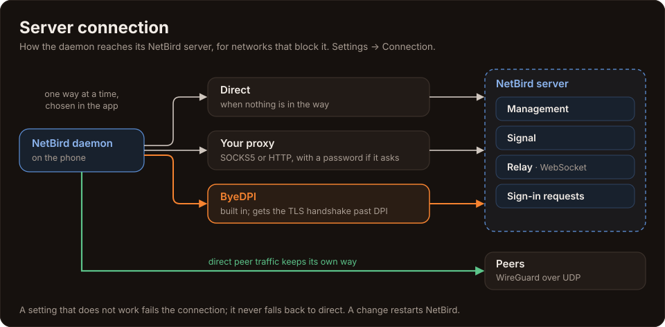
</p>

### Patches to NetBird

BirdSocks keeps 8 patches in [`appctr/patches/`](appctr/patches/), each one documented in [`recreate_patches.sh`](appctr/patches/recreate_patches.sh):

| Patch | Purpose |
|---|---|
| `01-socks5-birdsocks` | The SOCKS5 and DNS proxies of netstack mode, fit for a phone: a password, NetBird names, direct internet when no peer routes a destination, fallback across a name's addresses, the VPN mode's resolver, and the DNS table for the app |
| `02-android-system-info` | The dashboard shows the device as Android with its model and version |
| `03-android-interfaces` | Interfaces listed the way Android 11+ allows (a copy of `wlynxg/anet`), so ICE finds candidates and P2P forms |
| `04-daemon-network-events` | Network switches and losses reach the daemon, which redials at once |
| `05-engine-android-hooks` | Search domains and NetBird's own domains handed to the proxies |
| `06-connect-faster` | No kernel-WireGuard probe in netstack mode (it closed Signal's socket on Android), and faster redials of stuck connections |
| `07-inbound-forwarding` | Peers reach the phone's own services; the app's proxies stay closed to them |
| `08-control-proxy` | Management, signal, the relay and the daemon's HTTP requests through a SOCKS5 or HTTP proxy, or ByeDPI |

---

## 🚀 Getting Started

### Download

Get the latest APK from [Releases](https://github.com/bropines/birdsocks/releases/latest), or add the repository to [Obtainium](https://apps.obtainium.imranr.dev/redirect?r=obtainium://add/https://github.com/bropines/birdsocks) to get updates.

> **Architectures:** `arm64-v8a`, `armeabi-v7a`, `x86`, `x86_64`, and a universal APK. **Android 7.0** or newer.

### First steps

1. Open BirdSocks and sign in: **NetBird Cloud** or **Own server**, then the browser or a setup key.
2. Point apps at `127.0.0.1:48125` as **SOCKS5 with remote DNS** (`socks5h`). A proxy client such as Throne or AdGuard can carry apps that have no proxy setting.
3. For NetBird names in any app, use the DNS proxy `127.0.0.1:48153`, or turn on **VPN mode** in Settings → Tunnel mode.

The [user guide](docs/GUIDE.md) covers setups with AdGuard and Throne, the server connection, VPN mode and troubleshooting.

### Build from source

<details>
<summary><strong>Build instructions</strong></summary>

You need the Android SDK and NDK, Go and gomobile. [`docs/BUILDING.md`](docs/BUILDING.md) has the details.

```bash
git clone --recursive https://github.com/bropines/birdsocks.git
cd birdsocks

# The native core: NetBird's daemon with BirdSocks' patches, and the gomobile bridge
export ANDROID_HOME=~/android-sdk ANDROID_NDK_HOME=~/android-sdk/ndk/28.2.13676358
(cd appctr && ./build.sh)

# Debug build (installs beside a release as *.dev, no keystore needed)
./gradlew assembleDebug

# Release build: needs your own keystore (see docs/RELEASING.md)
./gradlew assembleRelease
```

Releases are built by GitHub Actions from a `v*` tag: all four ABIs, signed, with `SHA256SUMS`. See [`docs/RELEASING.md`](docs/RELEASING.md).

</details>

---

## 📚 Documentation

| Document | What it covers |
|---|---|
| [User guide](docs/GUIDE.md) | Setup, the proxies, VPN mode, the server connection, Throne and AdGuard, troubleshooting |
| [Automation](docs/AUTOMATION.md) | Tasker and adb actions, action links and invite links |
| [Building](docs/BUILDING.md) | The NetBird daemon, the bridge and the APK |
| [Releasing](docs/RELEASING.md) | From a tag to signed APKs; the signing secrets |
| [Licenses](docs/LICENSES.md) | BirdSocks' licence and every component it ships |
| [Translating](docs/TRANSLATING.md) | Adding a language |
| [Roadmap](docs/ROADMAP.md) | What comes next |
| [Contributing](CONTRIBUTING.md) | How to send a change |
| [`agents.md`](agents.md) | Architecture and rules for contributors, human or AI |
| [Data catalog](docs/DATA_CATALOG.md) | What the daemon reports and what the app shows |

---

## 🌐 Restricted networks

Where the NetBird server is blocked or its TLS handshake is filtered, set **Settings → Connection → Server connection**:

- **Proxy:** your SOCKS5 or HTTP proxy, with a username and password if it asks for them. Server names go to it unresolved, so a poisoned resolver cannot redirect them.
- **ByeDPI:** a built-in [ByeDPI](https://github.com/hufrea/byedpi) on a random loopback address desyncs the TLS handshake. The flags are editable, and options that would bind, fork or touch files are dropped.

What goes this way: management, signal, the relay (over WebSocket) and the daemon's sign-in and update requests. Traffic between peers is WireGuard over UDP and keeps its own way. Loopback, private and metadata addresses never go through the proxy.

---

## ⚡ Automation

Turn on **Settings → Automation**, generate a token, and send intents from Tasker, MacroDroid or adb:

```bash
adb shell am broadcast -n io.github.bropines.birdsocks/.core.AutomationReceiver \
  -a io.github.bropines.birdsocks.action.TOGGLE --es secret <token>
```

The actions are `CONNECT`, `DISCONNECT`, `TOGGLE`, `RESTART`, `GET_STATUS`, `SET_EXIT_NODE`, `SWITCH_ACCOUNT`, `SET_TUN` and `SET_SERVER_CONNECTION`. Links work too: `birdsocks://connect`, `birdsocks://exit-node?peer=…`, `birdsocks://add-account?server=…`. A link asks before it acts unless it carries the token. The full list is in [`docs/AUTOMATION.md`](docs/AUTOMATION.md).

---

## 🔒 Privacy and security

- **No telemetry.** NetBird's metrics push stays off. BirdSocks talks to your NetBird server, the relays it names and NetBird's update check. Its exit-node check opens a connection to 1.1.1.1, 8.8.8.8 or 77.88.8.8 through the proxy, and sends nothing over it.
- **Credentials:** the proxies' credentials and the automation token stay on the phone. A settings backup leaves them out; a full backup encrypts them with your password.
- **Loopback only by default:** the proxies listen on loopback. Shared on the LAN without a password, the SOCKS5 proxy shows a warning.
- **Peers:** with Access to the phone on, peers reach only what your ACLs allow, and never BirdSocks' own proxies.

---

## 🤝 Contributing

Issues and pull requests are welcome. Read [`CONTRIBUTING.md`](CONTRIBUTING.md) and [`agents.md`](agents.md) first. In short:
- daemon changes are patches;
- strings go in English and Russian;
- every change in behaviour gets a line in the changelog.

Bug reports are most useful with the debug bundle from Diagnostics → Logs.

---

## 💡 Credits

| | |
|-|-|
| **Development** | [Claude](https://claude.com/claude-code) by Anthropic, working in Claude Code. BirdSocks was written by Claude: the NetBird daemon integration and its patches, the bridge, the app, VPN mode, ByeDPI and the control-plane proxy, backups and automation, the icons, the screenshots and these docs. |
| **Idea, direction and testing** | [Bropines](https://github.com/bropines): what the app should be, every decision that mattered, and every test on real phones and real networks. |
| **Foundation** | BirdSocks' base comes from [TailSocks](https://github.com/bropines/tailsocks). |
| **Core engine** | [NetBird](https://github.com/netbirdio/netbird) by NetBird GmbH: the WireGuard mesh, its client and daemon. |
| **TUN engine** | [heiher/hev-socks5-tunnel](https://github.com/heiher/hev-socks5-tunnel) |
| **DPI bypass** | [hufrea/byedpi](https://github.com/hufrea/byedpi) |
| **Android interfaces** | [wlynxg/anet](https://github.com/wlynxg/anet) |

---

## 📜 License

BirdSocks is distributed under the **BSD 3-Clause** License; see [`LICENSE`](LICENSE). The components it ships and their licences are listed in [`docs/LICENSES.md`](docs/LICENSES.md), and in full in the app under About → Licenses.

*NetBird is a trademark of NetBird GmbH. BirdSocks is an independent, unofficial client and is not affiliated with or endorsed by NetBird GmbH.*
