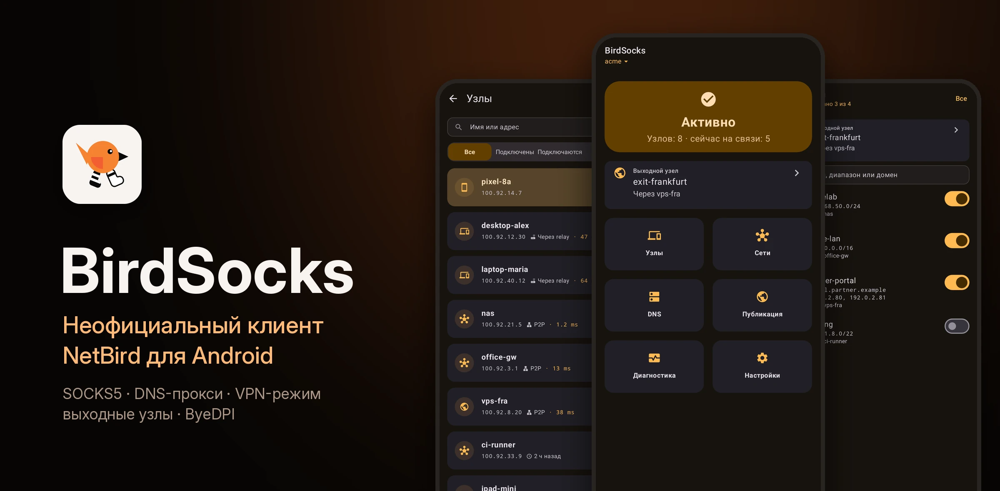
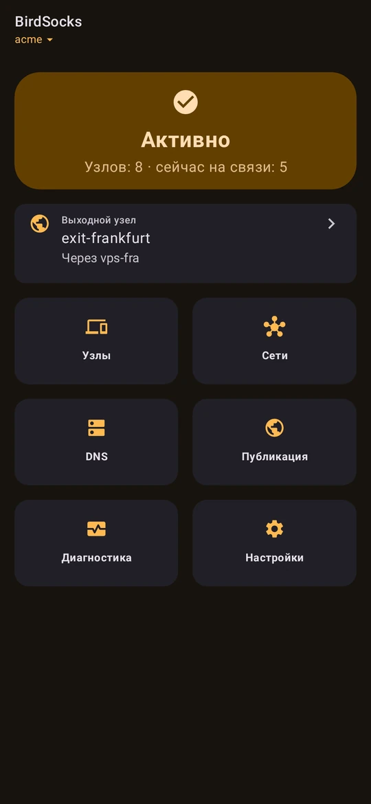
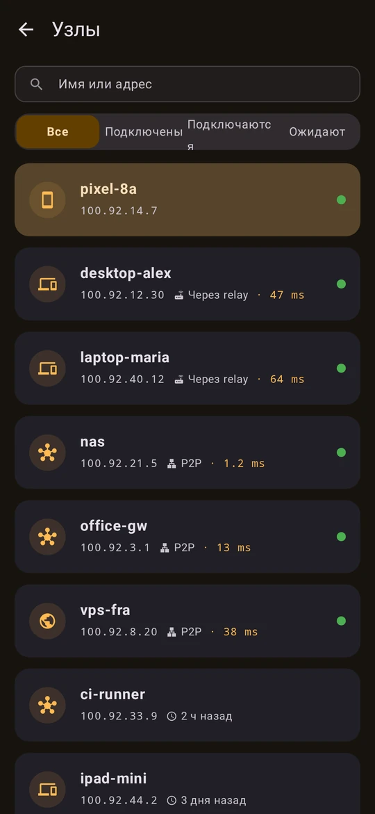
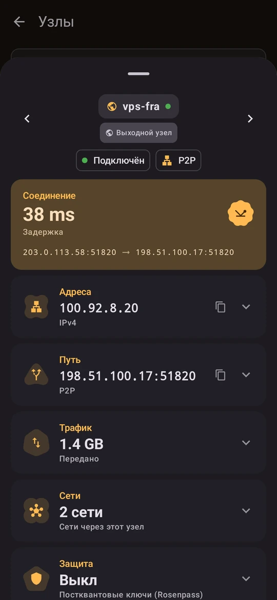
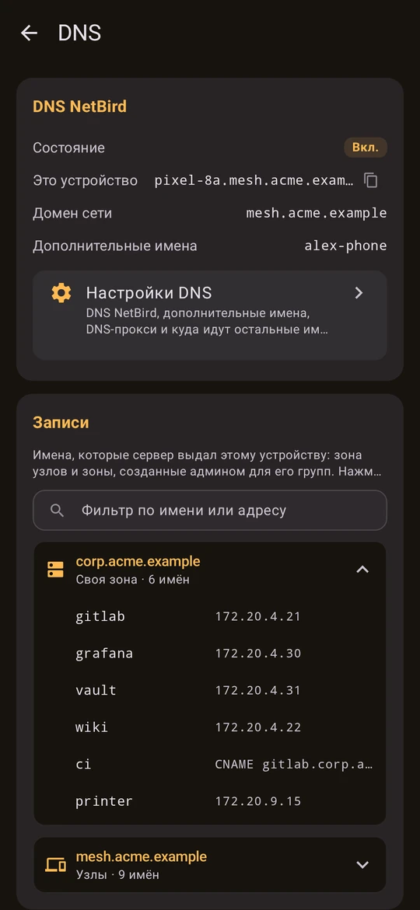
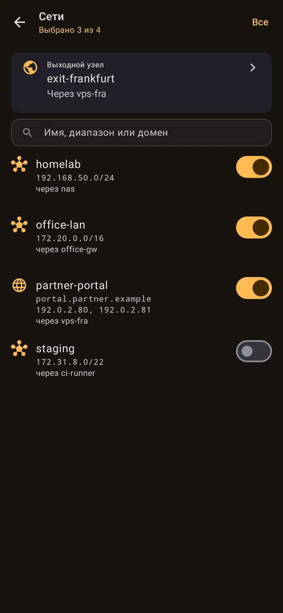
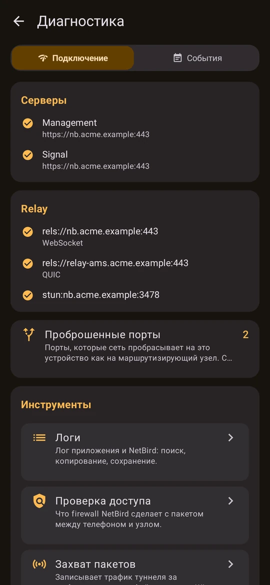
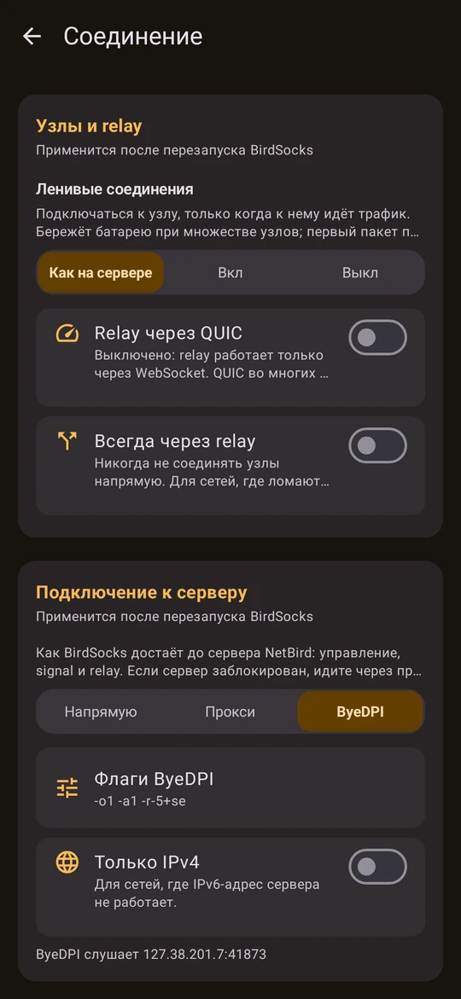
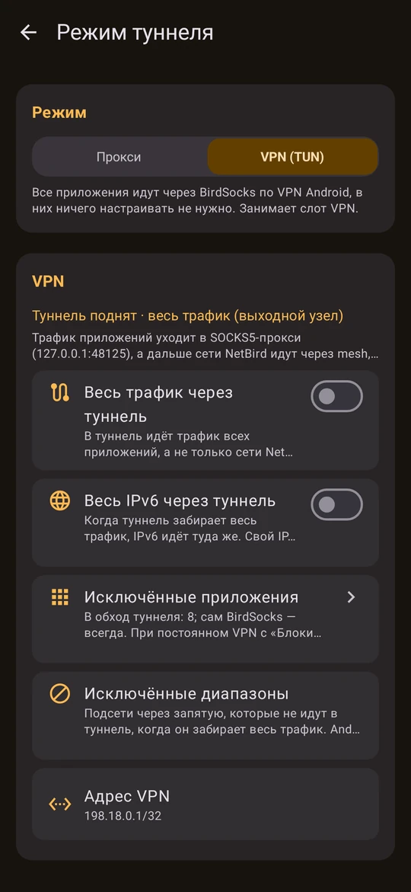
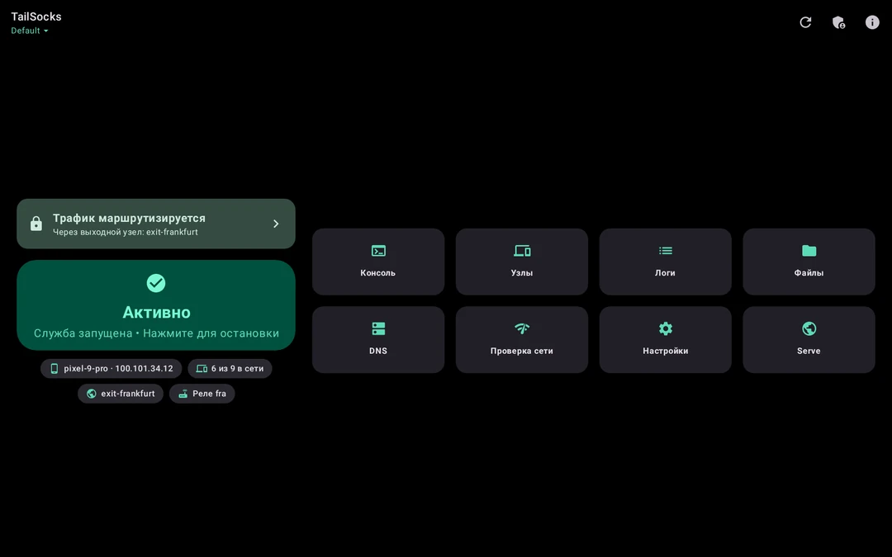

<p align="center">
  
</p>

<h1 align="center">BirdSocks</h1>

<p align="center">
  <strong>Неофициальный клиент NetBird для Android — ваша mesh-сеть как SOCKS5-прокси, DNS-прокси или VPN</strong>
</p>

<p align="center">
  <a href="readme.md">English</a> | <strong>Русский</strong>
</p>

<table align="center">
  <tr>
    <th>Релиз</th>
    <th>Загрузки</th>
    <th>Ядро NetBird</th>
    <th>Android</th>
    <th>Лицензия</th>
  </tr>
  <tr>
    <td align="center"><a href="https://github.com/bropines/birdsocks/releases/latest"></a></td>
    <td align="center"><a href="https://github.com/bropines/birdsocks/releases"></a></td>
    <td align="center"><a href="https://github.com/netbirdio/netbird/releases/tag/v0.80.0"></a></td>
    <td align="center"></td>
    <td align="center"><a href="LICENSE"></a></td>
  </tr>
</table>

<table align="center">
  <tr>
    <td align="center"><a href="https://github.com/bropines/birdsocks/releases/latest"></a></td>
    <td align="center"><a href="https://apps.obtainium.imranr.dev/redirect?r=obtainium://add/https://github.com/bropines/birdsocks"></a></td>
  </tr>
  <tr>
    <td align="center"><a href="https://github.com/bropines/birdsocks/releases"></a></td>
    <td align="center"><a href="https://boosty.to/pinus"></a></td>
  </tr>
</table>

<p align="center">
  
</p>

---

BirdSocks запускает на телефоне настоящий клиент [NetBird](https://netbird.io) как узел в пространстве пользователя и отдаёт его сеть приложениям так, как удобно вам:
- **локальный SOCKS5-прокси**: не требует разрешения на VPN и уживается с любым другим VPN, блокировщиком рекламы или прокси-клиентом;
- **DNS-прокси**: отвечает именами NetBird;
- **VPN-режим**: для приложений, которые не умеют работать через прокси.

Всё, что даёт NetBird, на месте: узлы и сети, выходные узлы, DNS NetBird, несколько аккаунтов, свои серверы. Если сеть блокирует сервер NetBird, до него довезут встроенный **ByeDPI** или ваш прокси.

Приложение показывает, что происходит на самом деле:
- подключены ли вы и как достаётся каждый узел: напрямую, через relay или спит до первого обращения;
- пропускает ли что-нибудь выходной узел;
- что DNS сервера выдал этому устройству;
- какое правило файрвола режет пакет.

> Что вошло в каждый релиз — в [`CHANGELOG.md`](CHANGELOG.md).

---

## ✨ Возможности

<p align="center">
  
</p>

### Сеть

| Возможность | Описание |
|---|---|
| **SOCKS5-прокси** | По умолчанию `127.0.0.1:48125`, можно любой адрес 127.x. Работает по TCP и UDP, может требовать логин и пароль; прежде чем открывать прокси в локальную сеть, их стоит задать. Узлы и их сети идут через NetBird, всё остальное — напрямую или через выходной узел. |
| **DNS-прокси** | `127.0.0.1:48153`. Сначала отвечает именами NetBird, остальное спрашивает у резолверов сети или у ваших запасных, у всех сразу. Имя NetBird никогда не уходит в публичный DNS. |
| **VPN-режим (TUN)** | Для приложений без настроек прокси: через hev-socks5-tunnel в тот же прокси. По умолчанию в туннель идут только диапазоны NetBird; весь трафик — с выходным узлом, доменным маршрутом или одним переключателем. Приложения можно исключать. |
| **Выходные узлы и сети** | Выбор сетей и выходного узла. Выходной узел проверяется через прокси; если он ничего не пропускает, это видно сразу, и предложен выход. |
| **Подключение к серверу** | Управление, signal и relay через SOCKS5- или HTTP-прокси либо встроенный **ByeDPI**, если сервер заблокирован или его TLS-рукопожатие фильтруется. |
| **Доступ к телефону** | Узлы заходят на сервисы самого телефона (adb, `sshd` из Termux, веб-сервер) по его адресу в NetBird, насколько разрешают ACL. Прокси BirdSocks для узлов закрыты. |
| **Публикация** | Локальный порт получает публичный HTTPS-адрес через обратный прокси NetBird, с PIN-кодом, паролем или SSO-группами. |

### Аккаунты и управление

| Возможность | Описание |
|---|---|
| **Вход** | NetBird Cloud или свой сервер, через браузер (SSO) или по ключу установки. |
| **Несколько аккаунтов** | У каждого аккаунта свои ключи и настройки, переключение с главного экрана. Сервер и ключ указываются сразу при добавлении, а **ссылка-приглашение** заполняет всё за вас. |
| **Узлы** | Сначала это устройство, потом все узлы: путь (P2P или relay), задержка, трафик, сети, которые они маршрутизируют. Спящие при ленивых соединениях узлы помечены как спящие. |
| **Экран DNS** | Проверка прокси, поиск имён, DNS-серверы и **все DNS-записи, которые сервер выдал этому устройству**, с фильтром. |
| **Сессия** | Окончание сессии видно заранее, продление — в браузере, без переподключения. |

### Диагностика

| Возможность | Описание |
|---|---|
| **Подключение** | Управление, signal и каждый relay с транспортом и ошибкой; DNS-серверы NetBird; адреса устройства. |
| **События** | События NetBird о сети, DNS, входе и соединениях; предупреждения приходят уведомлениями. |
| **Проверка доступа** | Что файрвол NetBird делает с пакетом к узлу или от него и какое правило это решает. |
| **Логи и захват** | Логи с фильтрами, захват пакетов в `.pcap`, отладочный архив (анонимизированный, сохранить или отправить в NetBird). |

### Вокруг приложения

| Возможность | Описание |
|---|---|
| **Автоматизация** | Интенты из Tasker и adb под токеном (подключить, отключить, выходной узел, аккаунт, VPN-режим, подключение к серверу) и ответ со статусом. |
| **Ссылки** | `birdsocks://` открывает любой экран. Ссылки-действия спрашивают подтверждение, ссылки-приглашения открывают заполненный новый аккаунт. |
| **Резервные копии** | Файл настроек или полная копия с аккаунтами NetBird и ключами под паролем. |
| **40 иконок** | Выбираются в «Настройки → Оформление и язык», в цветах BirdSocks или NetBird. |
| **И ещё** | Плитка быстрых настроек, запуск при загрузке, ярлыки на иконке, Material 3 с динамическими цветами, две панели на планшетах, английский и русский. |

---

## 📸 Скриншоты

<table>
  <tr>
    <td width="25%" align="center"><br/><sub>Подключено: выходной узел и шесть плиток</sub></td>
    <td width="25%" align="center"><br/><sub>Узлы: P2P, через relay или спят</sub></td>
    <td width="25%" align="center"><br/><sub>Узел: задержка, путь, трафик, сети</sub></td>
    <td width="25%" align="center"><br/><sub>DNS-записи, которые выдал сервер</sub></td>
  </tr>
  <tr>
    <td width="25%" align="center"><br/><sub>Сети и выходной узел</sub></td>
    <td width="25%" align="center"><br/><sub>Серверы, relay и их транспорт</sub></td>
    <td width="25%" align="center"><br/><sub>Сервер через прокси или ByeDPI</sub></td>
    <td width="25%" align="center"><br/><sub>VPN-режим для приложений без прокси</sub></td>
  </tr>
  <tr>
    <td colspan="2" align="center"><br/><sub>Настройки в две колонки в альбомной ориентации</sub></td>
    <td colspan="2" align="center"><br/><sub>На планшетах и складных — две панели</sub></td>
  </tr>
</table>

<sub>Отрисовано тестами превью самого приложения на выдуманной сети, без телефона и без чьих-либо настоящих данных: см. <a href="scripts/readme_shots.py"><code>scripts/readme_shots.py</code></a>.</sub>

---

## 🏗️ Как это устроено

<p align="center">
  
</p>

<p align="center">
  
</p>

### Слои

| Слой | Технология | Назначение |
|---|---|---|
| **Демон** | Go → `libnetbird.so` | Собственный демон NetBird (`client/server`) из закреплённого релиза плюс 8 патчей. Собирается статическим бинарником `GOOS=linux` и работает в режиме netstack дочерним процессом приложения. |
| **Мост** | Go → `appctr.aar` (gomobile) | Запускает и останавливает демон, даёт ему то, чего Linux-бинарник не найдёт сам (DNS-серверы, часовой пояс, устройство), и пробрасывает его gRPC API в Kotlin. |
| **Приложение** | Kotlin + Jetpack Compose | Служба переднего плана, экраны, VPN-режим, ByeDPI, резервные копии и автоматизация. |
| **Нативный код** | C → `hev-socks5-tunnel`, `byedpi` | Движок туннеля VPN-режима и обход DPI для подключения к серверу. |

### Принципы

- **Демон — это NetBird.** Приложение говорит с ним только через его gRPC API, никогда через CLI. Поведение меняется только маленьким описанным патчем.
- **Прокси живут дольше движка.** SOCKS5- и DNS-прокси не падают при переподключении, смене аккаунта и выходе из аккаунта; запрос немного ждёт NetBird, а потом идёт прямо в интернет.
- **Имя NetBird не утекает.** DNS-прокси и VPN-режим никогда не спрашивают публичный резолвер о доменах самой mesh-сети.
- **Управляющее подключение не обходит настройку.** Если выбран прокси или ByeDPI и он не работает, подключение падает, а не уходит молча напрямую.

<p align="center">
  
</p>

### Патчи к NetBird

BirdSocks держит 8 патчей в [`appctr/patches/`](appctr/patches/), каждый описан в [`recreate_patches.sh`](appctr/patches/recreate_patches.sh):

| Патч | Назначение |
|---|---|
| `01-socks5-birdsocks` | SOCKS5- и DNS-прокси режима netstack под телефон: пароль, имена NetBird, прямой интернет, когда адрес не маршрутизирует ни один узел, перебор адресов имени, резолвер VPN-режима и DNS-таблица для приложения |
| `02-android-system-info` | Панель показывает устройство как Android с моделью и версией |
| `03-android-interfaces` | Интерфейсы перечисляются так, как разрешает Android 11+ (копия `wlynxg/anet`), — ICE находит кандидатов, и P2P поднимается |
| `04-daemon-network-events` | Смена и потеря сети доходят до демона, и он сразу переподключается |
| `05-engine-android-hooks` | Поисковые домены и собственные домены NetBird передаются прокси |
| `06-connect-faster` | Нет пробы WireGuard в ядре в режиме netstack (на Android она закрывала сокет Signal) и быстрее перезапуск зависших соединений |
| `07-inbound-forwarding` | Узлы заходят на сервисы телефона; прокси приложения для них закрыты |
| `08-control-proxy` | Управление, signal, relay и HTTP-запросы демона через SOCKS5- или HTTP-прокси либо ByeDPI |

---

## 🚀 Как начать

### Скачать

Последний APK — в [релизах](https://github.com/bropines/birdsocks/releases/latest). Чтобы получать обновления, добавьте репозиторий в [Obtainium](https://apps.obtainium.imranr.dev/redirect?r=obtainium://add/https://github.com/bropines/birdsocks).

> **Архитектуры:** `arm64-v8a`, `armeabi-v7a`, `x86`, `x86_64` и универсальный APK. **Android 7.0** и новее.

### Первые шаги

1. Откройте BirdSocks и войдите: **NetBird Cloud** или **Свой сервер**, дальше браузер или ключ установки.
2. Укажите приложениям прокси `127.0.0.1:48125` — **SOCKS5 с удалённым DNS** (`socks5h`). Приложения без настроек прокси довезёт прокси-клиент вроде Throne или AdGuard.
3. Чтобы имена NetBird работали в любом приложении, используйте DNS-прокси `127.0.0.1:48153` или включите **VPN-режим** в «Настройки → Режим туннеля».

Связки с AdGuard и Throne, подключение к серверу, VPN-режим и решение проблем — в [руководстве](docs/GUIDE_RU.md).

### Сборка из исходников

<details>
<summary><strong>Инструкция по сборке</strong></summary>

Нужны Android SDK и NDK, Go и gomobile. Подробности — в [`docs/BUILDING_RU.md`](docs/BUILDING_RU.md).

```bash
git clone --recursive https://github.com/bropines/birdsocks.git
cd birdsocks

# Нативное ядро: демон NetBird с патчами BirdSocks и мост gomobile
export ANDROID_HOME=~/android-sdk ANDROID_NDK_HOME=~/android-sdk/ndk/28.2.13676358
(cd appctr && ./build.sh)

# Debug-сборка (ставится рядом с релизной как *.dev, keystore не нужен)
./gradlew assembleDebug

# Релизная сборка: нужен свой keystore (см. docs/RELEASING_RU.md)
./gradlew assembleRelease
```

Релизы собирает GitHub Actions по тегу `v*`: все четыре ABI, с подписью и `SHA256SUMS`. См. [`docs/RELEASING_RU.md`](docs/RELEASING_RU.md).

</details>

---

## 📚 Документация

| Документ | О чём |
|---|---|
| [Руководство](docs/GUIDE_RU.md) | Настройка, прокси, VPN-режим, подключение к серверу, Throne и AdGuard, решение проблем |
| [Автоматизация](docs/AUTOMATION_RU.md) | Действия из Tasker и adb, ссылки-действия и ссылки-приглашения |
| [Сборка](docs/BUILDING_RU.md) | Демон NetBird, мост и APK |
| [Выпуск](docs/RELEASING_RU.md) | От тега до подписанных APK; секреты подписи |
| [Лицензии](docs/LICENSES_RU.md) | Лицензия BirdSocks и всех компонентов в приложении |
| [Перевод](docs/TRANSLATING_RU.md) | Как добавить язык |
| [Дорожная карта](docs/ROADMAP_RU.md) | Что дальше |
| [Как помочь](CONTRIBUTING_RU.md) | Как прислать изменение |
| [`agents.md`](agents.md) | Архитектура и правила для разработчиков — людей и ИИ |
| [Каталог данных](docs/DATA_CATALOG.md) | Что отдаёт демон и что показывает приложение |

---

## 🌐 Сети с блокировками

Если сервер NetBird заблокирован или его TLS-рукопожатие фильтруется, откройте **«Настройки → Соединение → Подключение к серверу»**:

- **Прокси:** ваш SOCKS5- или HTTP-прокси, с логином и паролем, если он их требует. Имена серверов уходят в него нерезолвленными, так что подменённый DNS их не перенаправит.
- **ByeDPI:** встроенный [ByeDPI](https://github.com/hufrea/byedpi) на случайном loopback-адресе десинхронизирует TLS-рукопожатие. Флаги можно менять; опции, которые слушают порты, порождают процессы или трогают файлы, отбрасываются.

Этим путём идут управление, signal, relay (по WebSocket), а также запросы демона при входе и проверка обновлений. Трафик между узлами — WireGuard по UDP, он идёт своим путём. Loopback, частные адреса и адреса облачных метаданных через прокси никогда не идут.

---

## ⚡ Автоматизация

Включите **«Настройки → Автоматизация»**, сгенерируйте токен и шлите интенты из Tasker, MacroDroid или adb:

```bash
adb shell am broadcast -n io.github.bropines.birdsocks/.core.AutomationReceiver \
  -a io.github.bropines.birdsocks.action.TOGGLE --es secret <токен>
```

Действия: `CONNECT`, `DISCONNECT`, `TOGGLE`, `RESTART`, `GET_STATUS`, `SET_EXIT_NODE`, `SWITCH_ACCOUNT`, `SET_TUN`, `SET_SERVER_CONNECTION`. Работают и ссылки: `birdsocks://connect`, `birdsocks://exit-node?peer=…`, `birdsocks://add-account?server=…`. Ссылка без токена сначала спрашивает подтверждение. Полный список — в [`docs/AUTOMATION_RU.md`](docs/AUTOMATION_RU.md).

---

## 🔒 Приватность и безопасность

- **Никакой телеметрии.** Отправка метрик NetBird выключена. BirdSocks связывается с вашим сервером NetBird, relay, которые он называет, и проверкой обновлений NetBird. Проверка выходного узла открывает через прокси соединение к 1.1.1.1, 8.8.8.8 или 77.88.8.8 и ничего по нему не передаёт.
- **Учётные данные:** логины и пароли прокси и токен автоматизации остаются на телефоне. Файл настроек их не содержит; полная копия шифрует их вашим паролем.
- **По умолчанию только loopback:** прокси слушают loopback. Если открыть SOCKS5-прокси в локальную сеть без пароля, появится предупреждение.
- **Узлы:** при включённом доступе к телефону узлы видят только то, что разрешают ваши ACL, и никогда — прокси самого BirdSocks.

---

## 🤝 Участие

Issues и pull requests приветствуются. Сначала прочитайте [`CONTRIBUTING_RU.md`](CONTRIBUTING_RU.md) и [`agents.md`](agents.md). Коротко:
- изменения демона оформляются патчами;
- строки — на английском и русском;
- на каждое изменение поведения — строка в CHANGELOG.

К отчёту об ошибке лучше всего приложить отладочный архив из «Диагностика → Логи».

---

## ❤️ Поддержать проект

BirdSocks бесплатный и с открытым кодом. Если он вам пригодился, можно поддержать разработку:

<p align="center">
  <a href="https://boosty.to/pinus"></a>
</p>

Звезда на GitHub, отчёт об ошибке или рассказ другу, у которого стоит NetBird, тоже помогают.

---

## 💡 Благодарности

| | |
|-|-|
| **Разработка** | [Claude](https://claude.com/claude-code) от Anthropic, в Claude Code. BirdSocks написал Claude: интеграцию демона NetBird и его патчи, мост, приложение, VPN-режим, ByeDPI и прокси для подключения к серверу, резервные копии и автоматизацию, иконки, скриншоты и эту документацию. |
| **Идея, направление и тестирование** | [Bropines](https://github.com/bropines): каким должно быть приложение, все важные решения и каждый тест на настоящих телефонах и в настоящих сетях. |
| **Основа** | Основа BirdSocks взята из [TailSocks](https://github.com/bropines/tailsocks). |
| **Ядро** | [NetBird](https://github.com/netbirdio/netbird) от NetBird GmbH: mesh-сеть на WireGuard, её клиент и демон. |
| **Движок TUN** | [heiher/hev-socks5-tunnel](https://github.com/heiher/hev-socks5-tunnel) |
| **Обход DPI** | [hufrea/byedpi](https://github.com/hufrea/byedpi) |
| **Интерфейсы Android** | [wlynxg/anet](https://github.com/wlynxg/anet) |

---

## 📜 Лицензия

BirdSocks распространяется по лицензии **BSD 3-Clause**, см. [`LICENSE`](LICENSE). Компоненты в приложении и их лицензии перечислены в [`docs/LICENSES_RU.md`](docs/LICENSES_RU.md), а полные тексты есть в самом приложении: «О приложении → Лицензии».

*NetBird — товарный знак NetBird GmbH. BirdSocks — независимый неофициальный клиент, он не связан с NetBird GmbH и не одобрен ею.*
